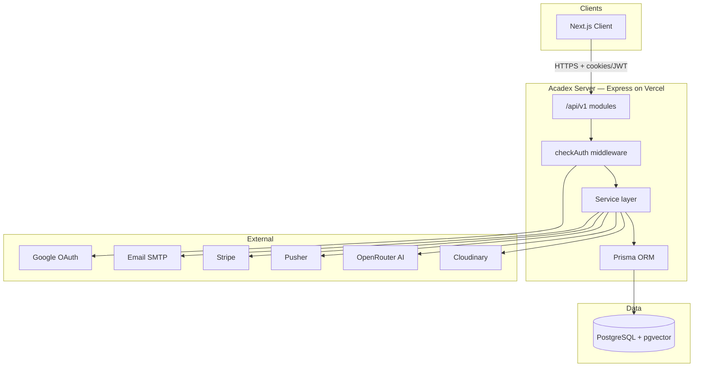
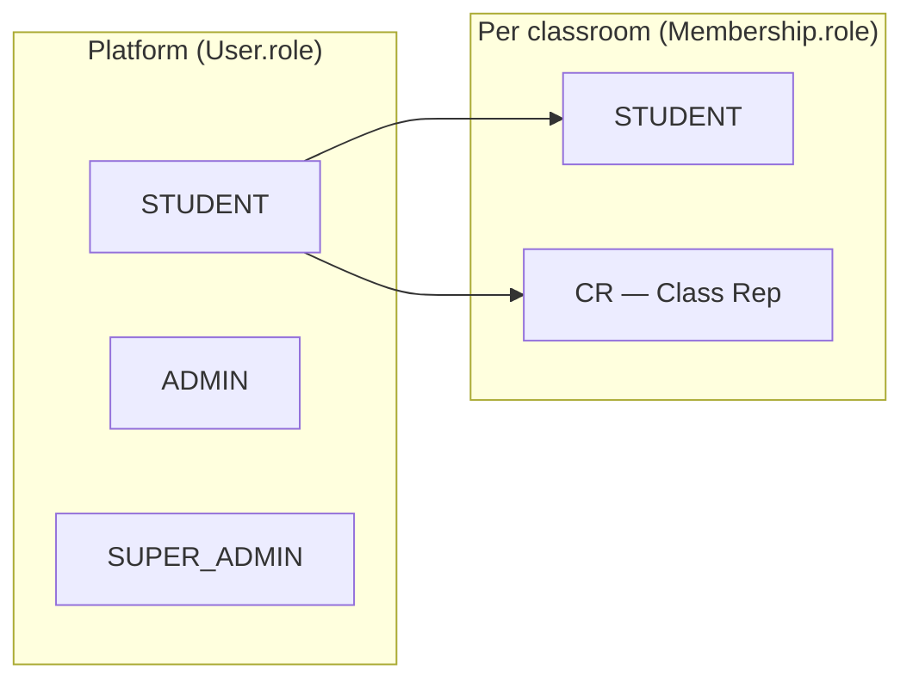
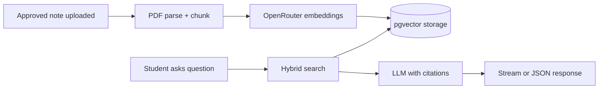
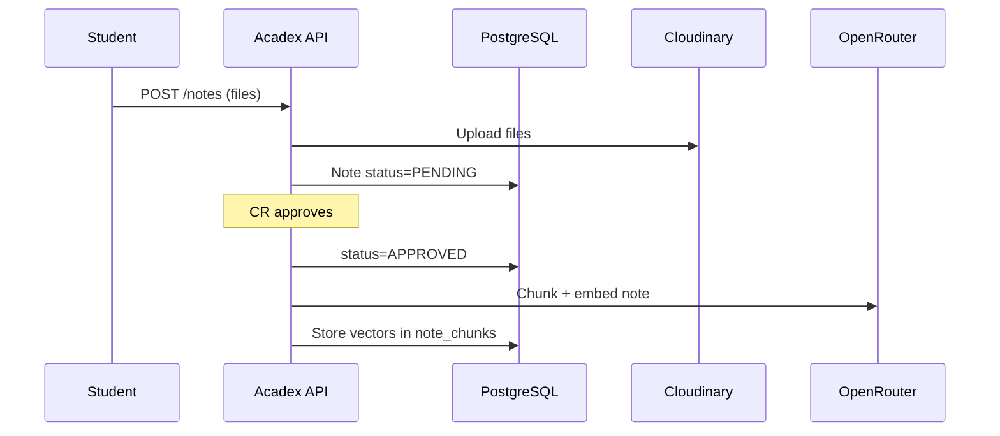
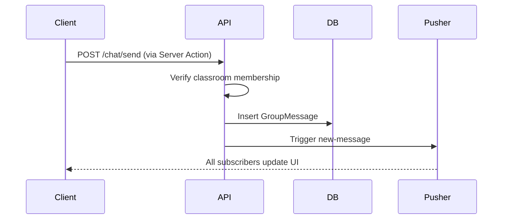
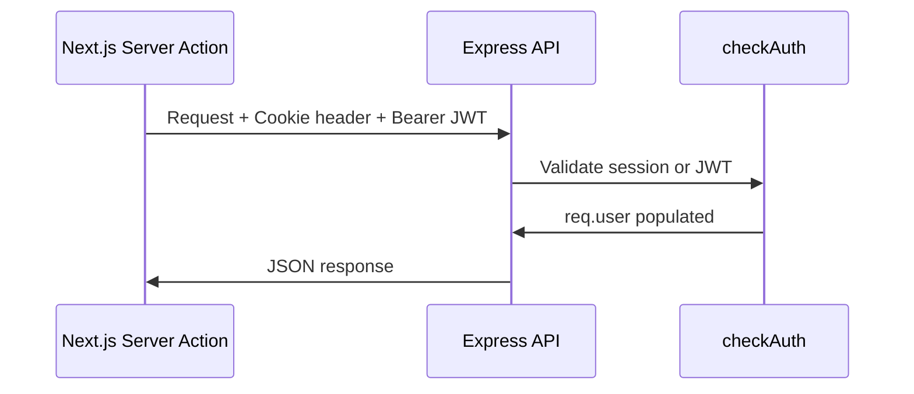

# Acadex Server — Product & Technical Documentation

**Acadex Server** is the backend API for [Acadex](https://acadex-client.vercel.app) — a classroom collaboration platform. It handles authentication, classroom management, note sharing with moderation, AI-powered study assistance (RAG), real-time group chat, donations, and admin operations.

| | |
|---|---|
| **Live API** | [acadex-server.vercel.app/api/v1](https://acadex-server.vercel.app/api/v1) |
| **Client** | [acadex-client.vercel.app](https://acadex-client.vercel.app) |
| **Stack** | Express 5 · Prisma 7 · PostgreSQL (Neon) · TypeScript |

---

## Table of Contents

1. [System Overview](#system-overview)
2. [Architecture](#architecture)
3. [User Roles & Permissions](#user-roles--permissions)
4. [Feature Modules](#feature-modules)
5. [End-to-End Flows](#end-to-end-flows)
6. [Database Model](#database-model)
7. [Authentication & Security](#authentication--security)
8. [External Integrations](#external-integrations)
9. [API Reference Summary](#api-reference-summary)
10. [Local Development](#local-development)
11. [Deployment](#deployment)

---

## System Overview

Acadex Server powers every backend capability of the platform:

| Domain | What the server does |
|--------|----------------------|
| **Identity** | Register, login, Google OAuth, email verification, password reset |
| **Classrooms** | Create, join, memberships, CR promotion, leaderboards |
| **Content** | Subjects, folders, notes with CR approval workflow |
| **Engagement** | Favorites, threaded comments, likes |
| **Real-time chat** | Per-classroom group messages via Pusher |
| **AI assistant** | RAG over approved notes — embeddings, hybrid search, streaming |
| **Platform ops** | Admin stats, classroom moderation, global notices |
| **Monetization** | Stripe donation checkout |

The API is **REST-first** under `/api/v1`, with **SSE streaming** for the chatbot and **Pusher** for chat events.

---

## Architecture



### Module pattern

Each feature lives in `src/app/module/<name>/`:

```
module/
├── *.route.ts        # Express routes + middleware
├── *.controller.ts   # HTTP handlers
├── *.service.ts      # Business logic
├── *.validation.ts   # Zod schemas
└── *.interface.ts    # Types
```

Registered in `src/app/routes/index.ts` and mounted at `/api/v1`.

---

## User Roles & Permissions

### Two-layer permission model

Acadex separates **platform identity** from **classroom membership**:



| Layer | Enum | Enforced by |
|-------|------|-------------|
| Platform | `Role`: STUDENT, ADMIN, SUPER_ADMIN | `checkAuth(Role...)` on routes |
| Classroom | `MembershipRole`: STUDENT, CR | `checkClassroomMember()` / `checkClassroomRole(CR)` + service guards |

### Permission matrix (high level)

| Action | Student | CR | Admin |
|--------|---------|-----|-------|
| Join classroom | ✅ | ✅ | ✅ |
| Upload note | ✅ (pending) | ✅ | ✅ |
| Approve/reject notes | ❌ | ✅ | — |
| Manage subjects/folders | ❌ | ✅ | — |
| Promote member to CR | ❌ | ✅ | — |
| Group chat send/read | ✅ | ✅ | ✅ |
| Delete own chat message | ✅ | ✅ | ✅ |
| Delete any chat message | ❌ | ✅ | — |
| AI assistant ask | ✅ | ✅ | ✅ |
| Reindex AI content | ❌ | ✅ | — |
| Moderate classrooms | ❌ | ❌ | ✅ |
| Manage admins | ❌ | ❌ | Super Admin only |

---

## Feature Modules

### 1. Authentication (`/api/v1/auth` + `/api/auth`)

- Email/password registration with **email OTP verification**  
- Login returns JWT pair + Better Auth session  
- **Google OAuth** for social sign-in  
- Forgot/reset password, change password, refresh tokens  
- Profile read/update with optional Cloudinary avatar  

**Dual auth in `checkAuth`:**
1. Valid `better-auth.session_token` → authenticated  
2. Else JWT from `accessToken` cookie or `Authorization: Bearer` header  

### 2. Classrooms (`/api/v1/classrooms`)

- Create with unique join code; creator becomes **CR**  
- Join via code, leave classroom, list memberships  
- CR: list members, promote/demote roles  
- Leaderboards (per user and per classroom)  
- Admin: approve/reject/ban/delete classrooms, paginated queue  

### 3. Curriculum — Subjects & Folders

```
Classroom → Subject → Folder (optional) → Note
```

- **CR** creates/edits/deletes subjects and folders  
- All members can browse structure  

### 4. Notes (`/api/v1/notes`)

- Upload up to 10 files (PDF/images) → **Cloudinary**  
- Status workflow: `PENDING` → CR approves → `APPROVED` (or `REJECTED`)  
- Students see approved notes only; **CR** sees all statuses  
- Delete: uploader or CR  

### 5. Favorites & Comments

- Toggle favorite per note  
- Comments with **one-level replies** and likes  
- Delete: comment author or platform admin  

### 6. Real-time Group Chat (`/api/v1/chat`)

| Endpoint | Method | Description |
|----------|--------|-------------|
| `/chat/send` | POST | Send text message (members only) |
| `/chat/messages` | GET | Paginated history (`?classroomId=`, cursor) |
| `/chat/:id` | DELETE | Soft-delete (owner or CR) |

**Real-time:** Pusher channel `classroom-{classroomId}`  
- Events: `new-message`, `delete-message`  

Messages stored in `GroupMessage` with optional `deletedAt` (soft delete).

### 7. AI Study Assistant (`/api/v1/chatbot`)

A **RAG (Retrieval-Augmented Generation)** pipeline over approved classroom notes:



| Capability | Details |
|------------|---------|
| Ingestion | PDF parsing, chunking, embedding batch jobs |
| Search | Vector similarity + PostgreSQL full-text |
| Modes | Q&A, summarize, quiz, study plan |
| Sessions | Per-user chat history per classroom |
| Streaming | `POST /chatbot/ask/stream` (SSE) |
| Reindex | CR triggers classroom or single-note reindex |
| Rate limit | Configurable per-user window |

Requires PostgreSQL **pgvector** extension.

### 8. Notices (`/api/v1/notices`)

- Single active platform-wide notice for students  
- Admin publish/toggle  

### 9. Donations (`/api/v1/donations`)

- Public Stripe Checkout (no login required)  
- Webhook + confirm endpoint for payment records  

### 10. Admin (`/api/v1/admins`)

- Dashboard stats: users, classrooms, notes, comments, donations  
- Super Admin: CRUD admin accounts  

---

## End-to-End Flows

### Note upload → AI-ready



### Group chat message



### Authenticated API request



---

## Database Model

Prisma multi-file schema in `prisma/schema/`:

| File | Models |
|------|--------|
| `auth.prisma` | User, Session, Account, Verification |
| `student.prisma` | Student profile |
| `admin_cr.prisma` | Admin, CR profile, CRApplication |
| `classroom.prisma` | Classroom, Membership, Subject, Folder, Note, NoteFile, Favorite, Comment, CommentLike |
| `group-chat.prisma` | GroupMessage |
| `chatbot.prisma` | ChatSession, ChatMessage |
| `donation.prisma` | Donation |

### Key relationships

```
User ──< Membership >── Classroom
Classroom ──< Subject ──< Folder ──< Note ──< NoteFile
Note ──< Comment ──< CommentLike
Classroom ──< GroupMessage >── User (sender)
User ──< ChatSession ──< ChatMessage
```

### Indexes & constraints

- Unique `userId + classroomId` on Membership  
- Unique join codes on Classroom  
- Composite index on `GroupMessage(classroomId, createdAt)` for chat pagination  

---

## Authentication & Security

| Mechanism | Purpose |
|-----------|---------|
| **Better Auth** | Sessions, OAuth, email OTP |
| **JWT** | Access + refresh tokens in httpOnly cookies |
| **Bearer header** | Fallback for proxied/streaming requests |
| **CORS** | Whitelist client origin + credentials |
| **Zod** | Request validation on all write endpoints |
| **Membership guards** | Classroom-scoped authorization in services |
| **Rate limiting** | Chatbot abuse protection |

**Production cookies:** `secure: true`, `sameSite: none` for cross-origin client ↔ API on Vercel.

---

## External Integrations

| Service | Used for |
|---------|----------|
| **PostgreSQL (Neon)** | Primary database + pgvector |
| **Cloudinary** | Note files, avatars, cover images |
| **OpenRouter** | Embeddings, LLM chat, vision/OCR |
| **Pusher** | Real-time classroom chat |
| **Stripe** | Donations |
| **Nodemailer + SMTP** | OTP and password emails |
| **Google OAuth** | Social login |

---

## API Reference Summary

Base URL: `https://acadex-server.vercel.app/api/v1`

| Prefix | Module |
|--------|--------|
| `/auth` | Login, register, OAuth, profile, tokens |
| `/users` | Admin provisioning |
| `/classrooms` | Classrooms, memberships, leaderboards |
| `/subjects` | Subject CRUD |
| `/folders` | Folder CRUD |
| `/notes` | Upload, approve, list, delete |
| `/favorites` | Toggle and list favorites |
| `/comments` | Comments, replies, likes |
| `/notices` | Platform notice |
| `/cover-pages` | Logo upload |
| `/chatbot` | AI assistant (ask, stream, sessions, reindex) |
| `/chat` | Group chat (send, messages, delete) |
| `/donations` | Stripe checkout & webhook |
| `/admins` | Admin management & stats |

**Also:** `POST /api/auth/*` — Better Auth handler  
**Health:** `GET /` → `Acadex Server is running 🚀`

---

## Local Development

### Prerequisites

- Node.js 20+
- PostgreSQL with **pgvector** extension (Neon recommended)
- Accounts: Cloudinary, SMTP, Google OAuth (optional), OpenRouter (for AI), Pusher (for chat)

### Setup

```bash
pnpm install
cp .env.example .env
# Fill all required variables (see .env.example)

pnpm exec prisma generate
pnpm exec prisma db push   # or run prisma/sql/*.sql for partial tables

pnpm dev    # http://localhost:5000
```

### Scripts

| Command | Description |
|---------|-------------|
| `pnpm dev` | Watch mode (`tsx watch`) |
| `pnpm build` | Prisma generate + TypeScript compile |
| `pnpm start` | Run compiled server |
| `pnpm vercel-build` | Vercel production build |

### Required environment variables

See `.env.example` for the full list. Critical groups:

- **Database:** `DATABASE_URL`  
- **Auth:** `BETTER_AUTH_*`, `ACCESS_TOKEN_SECRET`, `REFRESH_TOKEN_SECRET`, Google OAuth  
- **Email:** `EMAIL_*`  
- **Media:** `CLOUDINARY_*`  
- **AI:** `OPENROUTER_*`, `CHATBOT_*`  
- **Chat:** `PUSHER_*`  
- **Payments:** `STRIPE_*`  
- **Seed:** `SUPER_ADMIN_EMAIL`, `SUPER_ADMIN_PASSWORD`  

---

## Deployment

Hosted on **Vercel** as a serverless Express app (`vercel.json` → `dist/server.js`).

| Step | Action |
|------|--------|
| 1 | Connect GitHub repo to Vercel |
| 2 | Set all environment variables |
| 3 | Build command: `pnpm run vercel-build` |
| 4 | Set `BETTER_AUTH_URL` and `FRONTEND_URL` to production URLs |
| 5 | Configure Stripe webhook → `/api/v1/donations/webhook` |

**CORS** already includes `https://acadex-client.vercel.app`.

**Client pairing:** Set client `NEXT_PUBLIC_API_BASE_URL` to this server's `/api/v1` URL and matching `ACCESS_TOKEN_SECRET`.

---

## Related Documentation

- [Acadex Client documentation](../Acadex-client/DOCUMENTATION.md) — UI flows, pages, and frontend architecture  
- Live developer page on client: `/Developer`

---

*Acadex Server — the API behind classroom collaboration and AI-assisted study.*
